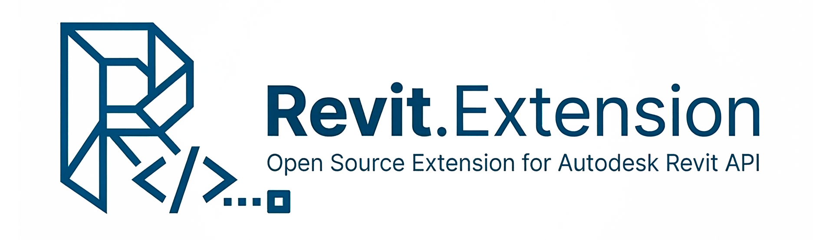

<div align="center">
  

# Revit.Extensions

[](https://github.com/apibim/Revit.Extensions/actions/workflows/ci.yml)
[](https://www.nuget.org/packages/Revit.Extensions)
[](https://www.nuget.org/packages/Revit.Extensions)
[](LICENSE)

</div>

A collection of extension methods for the **Autodesk Revit API**, designed to reduce boilerplate and make Revit add-in development more expressive. Supports **Revit 2020 – 2026**.

---

## Installation

```
dotnet add package Revit.Extensions
```

Or search for **`Revit.Extensions`** in the NuGet Package Manager inside Visual Studio.

---

## Revit version support

| Revit | Target framework | NuGet version |
| ----- | ---------------- | ------------- |
| 2020  | net47            | 2020.0.\*     |
| 2021  | net48            | 2021.0.\*     |
| 2022  | net48            | 2022.0.\*     |
| 2023  | net48            | 2023.0.\*     |
| 2024  | net48            | 2024.0.\*     |
| 2025  | net8.0-windows   | 2025.0.\*     |
| 2026  | net8.0-windows   | 2026.0.\*     |

The package automatically targets the correct framework — no manual configuration needed.

---

## API reference

### `DrawSession` — transient geometry (no transaction required)

`DrawSession` renders geometry directly into Revit's 3D views via the **DirectContext3D** API.
No model elements are created and no `Transaction` is needed.
All geometry disappears when the session is disposed or `Clear()` is called.

> All distances are in **Revit internal units (feet)**. Use `UnitUtils.ConvertToInternalUnits` to convert from meters or millimeters.

#### Setup in `App.cs`

Registration **must** happen in `IExternalApplication.OnStartup` via `RegisterDrawSession()`:

```csharp
using Revit.Extensions;

public class App : IExternalApplication
{
    public static DrawSession? DrawSession { get; private set; }

    public Result OnStartup(UIControlledApplication application)
    {
        // Registers the session with Revit's DirectContext3D service.
        DrawSession = application.RegisterDrawSession();
        return Result.Succeeded;
    }

    public Result OnShutdown(UIControlledApplication application)
    {
        DrawSession?.Dispose();   // unregisters the server and releases GPU buffers
        DrawSession = null;
        return Result.Succeeded;
    }
}
```

#### Supply `UIApplication` from your command

`DrawSession` needs `UIApplication` to call `RefreshActiveView()` after drawing. Pass it once from the first command that uses the session:

```csharp
public Result Execute(ExternalCommandData commandData, ref string message, ElementSet elements)
{
    var session = App.DrawSession;
    if (session is null) return Result.Failed;

    // Supply once — idempotent, safe to call every time.
    session.SetUIApplication(commandData.Application);

    // ... drawing calls ...
    return Result.Succeeded;
}
```

> **Important:** Do **not** wrap `DrawSession` in a `using` statement inside a command. Revit renders the 3D view *after* `Execute()` returns, so the session must stay alive. Store it at application scope and call `Dispose()` only in `OnShutdown`.

---

#### Lines and wireframes

```csharp
var session = App.DrawSession;
session.SetUIApplication(commandData.Application);

// Line between two points
session.DrawLine(new XYZ(0, 0, 0), new XYZ(10, 0, 0), DrawExtensions.Blue);

// Revit Line object
session.DrawLine(line, DrawExtensions.Red);

// 3-axis cross marker (radius in feet; default ≈ 0.1 m)
session.DrawCross(new XYZ(5, 5, 0), radius: 0.328, DrawExtensions.Red);

// Point marker (alias for DrawCross)
session.DrawPoint(new XYZ(5, 5, 0), radius: 0.328, DrawExtensions.Green);

// Point marker with a text label
session.DrawPoint(new XYZ(5, 5, 0), label: "P0", radius: 0.328, DrawExtensions.Orange);

// Closed polygon (edges only)
session.DrawPolygon(new[] { new XYZ(0,0,0), new XYZ(10,0,0), new XYZ(5,10,0) }, DrawExtensions.Orange);

// Wireframe bounding box (12 edges)
session.DrawBoundingBox(element.get_BoundingBox(null), DrawExtensions.Cyan);

// Calls are fluent — chain them
session
    .DrawLine(p0, p1, DrawExtensions.Blue)
    .DrawCross(p0, color: DrawExtensions.Red)
    .DrawBoundingBox(bbox, DrawExtensions.Cyan);
```

---

#### Solids and meshes

`DrawSolid` and `DrawMesh` render shaded geometry with optional transparency.
Face triangulation is performed on the **main thread** (Revit geometry API requirement); GPU buffers are built lazily on the render thread.

```csharp
// Revit Solid — shaded faces + tessellated edges
session.DrawSolid(solid,
    faceColor:    DrawExtensions.Blue,
    edgeColor:    DrawExtensions.DarkBlue,
    transparency: 0.5);   // 0.0 = opaque, 1.0 = invisible

// Revit Mesh — flat-shaded triangles
session.DrawMesh(mesh, DrawExtensions.Green);

// Extract geometry from an element and draw it
var opts = new Options { ComputeReferences = false };
foreach (GeometryObject obj in element.get_Geometry(opts))
{
    if (obj is Solid solid && solid.Volume > 0)
        session.DrawSolid(solid, DrawExtensions.Blue, transparency: 0.3);
}
```

---

#### Box and sphere primitives

Filled, shaded primitives that do not require a `Solid` — useful for debug markers:

```csharp
// Filled box from corner points
session.DrawBox(
    min: new XYZ(0, 0, 0),
    max: new XYZ(3.28, 3.28, 3.28),   // 1 m × 1 m × 1 m
    faceColor:    DrawExtensions.Blue,
    edgeColor:    DrawExtensions.DarkBlue,
    transparency: 0.4);

// Filled box from a BoundingBoxXYZ
session.DrawBox(element.get_BoundingBox(null), DrawExtensions.Blue, transparency: 0.3);

// Filled box from an Outline
session.DrawBox(outline, DrawExtensions.Cyan);

// UV sphere
session.DrawSphere(
    center:       new XYZ(5, 5, 3),
    radius:       1.64,                // 0.5 m
    faceColor:    DrawExtensions.Red,
    edgeColor:    DrawExtensions.DarkBlue,   // null = no equator lines
    transparency: 0.0);
```

---

#### Text labels

Text is tessellated from a real system font via `System.Drawing.GraphicsPath` + `LibTessDotNet`.
Results are cached per `(text, fontFamily)`, so repeated calls are cheap.
Inner glyph holes (letters like **O A B D**) are handled correctly via EvenOdd winding.

```csharp
// Basic label at a position (height in feet; default 0.5 ft ≈ 15 cm)
session.DrawText("Hello, Revit!", origin: new XYZ(0, 0, 0));

// Custom height, color and font
session.DrawText(
    text:       "Column C1",
    origin:     new XYZ(10, 5, 0),
    height:     1.0,                        // ~30 cm
    color:      DrawExtensions.Red,
    fontFamily: "Consolas");

// Text on a vertical face (supply the face normal)
session.DrawText(
    text:   "Front",
    origin: new XYZ(0, 0, 5),
    height: 0.5,
    normal: XYZ.BasisY);                    // text lies in the XZ plane

// Semi-transparent label
session.DrawText("Ghost", origin, transparency: 0.5);
```

---

#### Clearing geometry

```csharp
// Remove all drawn primitives; the session stays registered and alive.
session.Clear();
```

---

#### Available colors

`DrawExtensions` provides ten predefined `Autodesk.Revit.DB.Color` values:

| Property      | RGB            |
| ------------- | -------------- |
| `White`       | 255, 255, 255  |
| `Black`       | 0, 0, 0        |
| `Blue`        | 0, 0, 255      |
| `DarkBlue`    | 0, 0, 102      |
| `Red`         | 255, 0, 0      |
| `Green`       | 0, 255, 0      |
| `DarkGreen`   | 0, 128, 0      |
| `Purple`      | 255, 0, 255    |
| `Cyan`        | 0, 255, 255    |
| `Orange`      | 255, 153, 76   |

Pass `null` to any color parameter to use the default (`DarkBlue` for lines, `Blue` for faces).
You can also pass any `new Color(r, g, b)` directly.

---

#### `DrawSession` method reference

| Method | Description |
|--------|-------------|
| `DrawLine(from, to, color?)` | Line between two `XYZ` points |
| `DrawLine(line, color?)` | Revit `Line` object |
| `DrawCross(point, radius?, color?)` | 3-axis cross marker |
| `DrawPoint(point, radius?, color?)` | Point marker (alias for `DrawCross`) |
| `DrawPoint(point, label, radius?, color?, normal?)` | Point marker with a text label |
| `DrawPolygon(points, color?)` | Closed polygon (wireframe) |
| `DrawBoundingBox(bbox, color?)` | Wireframe `BoundingBoxXYZ` |
| `DrawBoundingBox(outline, color?)` | Wireframe `Outline` |
| `DrawSolid(solid, faceColor?, edgeColor?, transparency?)` | Shaded `Solid` with edges |
| `DrawMesh(mesh, color?)` | Flat-shaded `Mesh` |
| `DrawBox(min, max, faceColor?, edgeColor?, transparency?)` | Filled axis-aligned box |
| `DrawBox(bbox, faceColor?, edgeColor?, transparency?)` | Filled box from `BoundingBoxXYZ` |
| `DrawBox(outline, faceColor?, edgeColor?, transparency?)` | Filled box from `Outline` |
| `DrawSphere(center, radius, faceColor?, edgeColor?, transparency?)` | Filled UV sphere |
| `DrawText(text, origin, height?, color?, fontFamily?, transparency?, normal?)` | Tessellated text label |
| `Clear()` | Remove all geometry (session stays alive) |
| `SetUIApplication(uiApp)` | Supply `UIApplication` for view refresh |
| `Dispose()` | Unregister from DirectContext3D and release GPU buffers |

---

### `DrawExtensions` — persistent geometry (requires transaction)

Creates `DirectShape` elements and text notes permanently in the model.
All methods must be called inside an active `Transaction`.

```csharp
using var t = new Transaction(doc, "Debug draw");
t.Start();

doc.DrawLine(pt1, pt2, DrawExtensions.Red);
doc.DrawCross(center, radius: 0.5, DrawExtensions.Blue);
doc.DrawPoint(center, label: "P0", radius: 0.3, DrawExtensions.Green);
doc.DrawText("Hello", position, DrawExtensions.Purple);
doc.DrawPolygon(new[] { p0, p1, p2 }, DrawExtensions.Orange);
bbox.Draw(doc, DrawExtensions.Cyan, drawPoints: true);

t.Commit();
```

---

### `GeometryExtensions`

Helpers for working with Revit geometry types (`XYZ`, `Outline`, `BoundingBoxXYZ`).

```csharp
using Revit.Extensions;

// Convert XYZ ↔ value tuple
XYZ point = new XYZ(1.0, 2.0, 3.0);
(double X, double Y, double Z) vec = point.ToVector();   // (1.0, 2.0, 3.0)
XYZ restored = vec.ToXYZ();                              // XYZ(1.0, 2.0, 3.0)

// Expand an Outline uniformly
Outline outline = new Outline(new XYZ(0, 0, 0), new XYZ(5, 5, 5));
Outline expanded = outline.Extend(size: 2);   // min −2, max +2 on every axis

// Transform a BoundingBoxXYZ from local to world space
BoundingBoxXYZ bbox = element.get_BoundingBox(view);
BoundingBoxXYZ? worldBbox = bbox.TransformBoundingBox();
```

---

### `PointExtensions`

Unit conversion for `XYZ` coordinates using Revit's `UnitUtils`.

```csharp
using Autodesk.Revit.DB;
using Revit.Extensions;

// Revit stores coordinates internally in feet.
// Convert a point from feet to meters (Revit 2021+):
XYZ pointInFeet = new XYZ(3.28084, 0, 0);
XYZ pointInMeters = pointInFeet.Recalculate(UnitTypeId.Meters);
// → XYZ(1.0, 0, 0)
```

> **Revit 2020** uses the legacy `DisplayUnitType` enum — the overload is selected automatically via conditional compilation.

---

### `ElementExtensions`

Helpers for collecting elements and grids from the active document.

```csharp
using Revit.Extensions;

// Collect selected elements, or fall back to all FamilyInstances + HostObjects in the active view
IList<Element> elements = ElementExtensions.GetAllElementOrSelected(uiDocument);

// Get all grids from the level closest to elevation 0
IList<Grid> grids = ElementExtensions.GetAllGridFromFirstLevel(document, out string? levelName);
if (levelName is not null)
    TaskDialog.Show("Grids", $"Found {grids.Count} grids on level '{levelName}'.");
```

---

### `AsyncTasksExecutor`

Run async code synchronously inside the Revit event loop, where `async/await` on the main thread is unsupported.

```csharp
using Revit.Extensions;

// Execute a Task<T> synchronously
string result = AsyncTasksExecutor.Execute(async () =>
{
    await Task.Delay(100);
    return "done";
});

// Execute a ValueTask<T> synchronously
int value = AsyncTasksExecutor.Execute(async () =>
{
    await Task.Yield();
    return 42;
});
```

---

## Contributing

Contributions are welcome! Please open an issue or submit a pull request.

1. Fork the repository
2. Create a feature branch: `git checkout -b feature/my-extension`
3. Add your extension in `Revit.Extensions/Extensions/` with a corresponding test in `tests/Extensions/`
4. Open a pull request against `main`

---

## License

MIT © [Apibim SpA](https://apibim.com)
